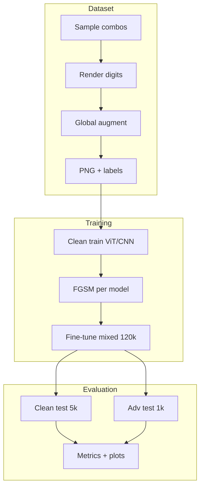

# 4-captcha

Synthetic four-digit captcha recognition with Vision Transformer and compact CNN solvers, FGSM adversarial training, and per-position evaluation.

## Overview

The pipeline generates grayscale $320 \times 80$ captcha images with per-digit font variation, elastic deformation, Bézier noise curves, and FGSM perturbations. Two classifiers output logits $\mathbf{Z} \in \mathbb{R}^{B \times 4 \times 10}$. The training objective is

$$\mathcal{L} = \sum_{p=1}^{4} \mathrm{CE}(\mathbf{Z}_{:,p,:}, y_p)$$

FGSM examples follow

$$x_{\mathrm{adv}} = \mathrm{clip}\bigl(x + \varepsilon \cdot \mathrm{sign}(\nabla_x \mathcal{L}),\, 0,\, 1\bigr)$$

with $\varepsilon \in \{0.015, 0.03\}$.

| Split | Images |
|-------|--------|
| Clean train | 100,000 |
| Clean val | 5,000 |
| Clean test | 5,000 |
| Adv train (per model) | 20,000 |
| Adv val (per model) | 1,000 |
| Adv test (per model) | 1,000 |

## Project tree

```
4-captcha/
├── main.py
├── config.py
├── schemas.py
├── requirements.txt
├── .env.example
├── data/
│   ├── augment.py
│   ├── combinations.py
│   ├── dataset.py
│   ├── fonts.py
│   ├── labels.py
│   └── render_digits.py
├── models/
│   ├── cnn.py          # CompactCaptchaNet (~1.4M params)
│   └── vit.py          # CaptchaViT (~4.8M params)
├── train/
│   ├── factory.py
│   ├── loop.py
│   ├── loss.py
│   └── scheduler.py
├── attacks/
│   └── fgsm.py
├── eval/
│   ├── metrics.py
│   └── plots.py
├── scripts/
│   ├── generate_dataset.py
│   ├── train_clean.py
│   ├── generate_fgsm.py
│   ├── finetune.py
│   ├── evaluate.py
│   ├── plot_results.py
│   └── upload_hf.py
└── outputs/
    ├── metrics/
    ├── plots/
    └── predictions/
```

## Pipeline



## Setup

```bash
cp .env.example .env
pip install -r requirements.txt
```

По умолчанию `.env.example` задаёт полный прогон: 132 000 изображений, `CLEAN_EPOCHS=50`, `FINETUNE_EPOCHS=1`, `QUICK_MODE=false`. Флаг `QUICK_MODE=true` сокращает выборки и число эпох только для локальной проверки пайплайна, в обычной работе его не включают.

## Scripts

### `main.py`

Точка входа. Запускает шаги пайплайна по порядку или выборочно.

| Аргумент | Значения | Описание |
|----------|----------|----------|
| `--step` | `all`, `generate`, `train_clean`, `fgsm`, `finetune`, `evaluate`, `plot`, `upload` | Этап пайплайна, по умолчанию `all` |
| `--model` | `vit`, `cnn`, `both` | Модель для шагов обучения и FGSM, по умолчанию `both` |

```bash
python main.py --step all
python main.py --step train_clean --model vit
```

### `scripts/generate_dataset.py`

Генерация clean-сплитов с фиксированным `SEED=42`. Для каждого изображения: четыре цифры с отдельным шрифтом, растяжение, поворот $\pm 15°$, сдвиг, возможное перекрытие, затем elastic deformation, кривые Безье, шум, blur, gamma. Результат — PNG $320 \times 80$ и `labels.csv` в `data/clean/{train,val,test}/`. Комбинации цифр разбиты на непересекающиеся пулы: train sampling with replacement, val и test — из своих пулов.

```bash
python scripts/generate_dataset.py
```

### `scripts/train_clean.py`

Обучение ViT или CNN на `data/clean/train`. AdamW с warmup, отдельные learning rate для ViT и CNN. Валидация на `data/clean/val`, early stopping по exact match. Чекпоинты в `checkpoints/{vit,cnn}/clean/`, метрики эпох в `outputs/metrics/{model}_clean.json`.

```bash
python scripts/train_clean.py --model vit
python scripts/train_clean.py --model cnn
```

### `scripts/generate_fgsm.py`

White-box FGSM от обученной clean-модели. Для каждой модели отдельно: 20 000 adv train из подвыборки clean train, 1 000 adv val и 1 000 adv test из clean val и test. Половина примеров с $\varepsilon=0.015$, половина с $\varepsilon=0.03$. Сохранение в `data/adv/{vit,cnn}/{train,val,test}/`.

```bash
python scripts/generate_fgsm.py --model vit
python scripts/generate_fgsm.py --model cnn
```

### `scripts/finetune.py`

Дообучение clean-чекпоинта на смеси 100 000 clean train и 20 000 adv train той же модели. Learning rate $10^{-4}$ для обеих архитектур. После каждой эпохи — валидация на 1 000 clean val и 1 000 adv val. Чекпоинты в `checkpoints/{vit,cnn}/finetune/`, метрики в `outputs/metrics/{model}_finetune.json`.

```bash
python scripts/finetune.py --model vit
python scripts/finetune.py --model cnn
```

### `scripts/evaluate.py`

Оценка четырёх конфигураций: ViT clean, ViT finetune, CNN clean, CNN finetune на clean test и adv test соответствующей модели. Exact match, accuracy, precision, recall, MCC по позициям, robustness gap, attack success rate. Confusion matrices в `outputs/confusion/`, предсказания в `outputs/predictions/`, сводка в `outputs/metrics/test_results.json`.

```bash
python scripts/evaluate.py
```

### `scripts/plot_results.py`

Построение графиков из `outputs/metrics/` и `outputs/confusion/`: grouped bar charts по позициям для каждой модели и сплита, сравнение моделей на test, кривые loss и val exact match при обучении, chinchilla log-log loss.

```bash
python scripts/plot_results.py
```

### `scripts/upload_hf.py`

Загрузка `data/` в [pymlex/4-captcha](https://huggingface.co/datasets/pymlex/4-captcha), чекпоинтов и артефактов `outputs/` в [pymlex/4-captcha-solvers](https://huggingface.co/pymlex/4-captcha-solvers). Требуется `HF_TOKEN` в `.env`.

```bash
python scripts/upload_hf.py
```

## Usage

Полный пайплайн:

```bash
python main.py --step all
```

Отдельные шаги:

```bash
python main.py --step generate
python main.py --step train_clean --model vit
python main.py --step fgsm --model vit
python main.py --step finetune --model vit
python main.py --step evaluate
python main.py --step plot
python main.py --step upload
```

## Models

**CompactCaptchaNet** — four stride-2 conv blocks, reshape to $(1280, 20)$, `Conv1d` temporal mixing, adaptive pool to four positions, linear heads.

**CaptchaViT** — patch size $16 \times 16$, embed dim 256, depth 6, eight heads, learned position queries attend over patch tokens.

## Hugging Face

| Artefact | Repository |
|----------|------------|
| Dataset | [pymlex/4-captcha](https://huggingface.co/datasets/pymlex/4-captcha) |
| Checkpoints, metrics, plots | [pymlex/4-captcha-solvers](https://huggingface.co/pymlex/4-captcha-solvers) |

Set `HF_TOKEN` in `.env` before `upload`.

## Citation

If you found this project useful, please cite it as:

```bibtex
@misc{zyukov2026_4captcha,
  author       = {Alex Zyukov},
  title        = {4-captcha: Synthetic Captcha Recognition and Adversarial Fine-tuning},
  year         = {2026},
  publisher    = {GitHub},
  howpublished = {\url{https://github.com/pymlex/4-captcha}}
}
```

```bibtex
@article{dosovitskiy2020vit,
  title   = {An Image is Worth 16x16 Words: Transformers for Image Recognition at Scale},
  author  = {Dosovitskiy, Alexey and Beyer, Lucas and Kolesnikov, Alexander and others},
  journal = {arXiv preprint arXiv:2010.11929},
  year    = {2020}
}
```

```bibtex
@article{goodfellow2014explaining,
  title   = {Explaining and Harnessing Adversarial Examples},
  author  = {Goodfellow, Ian J and Shlens, Jonathon and Szegedy, Christian},
  journal = {arXiv preprint arXiv:1412.6572},
  year    = {2014}
}
```

The project is under GPL-3.0 license.
