# 4-captcha

Synthetic four-digit captcha recognition with Vision Transformer and compact CNN solvers, FGSM adversarial training, and exact-match evaluation.

## Dataset

Grayscale synthetic four-digit captcha images for robust digit-string recognition and adversarial fine-tuning experiments. Full release: [pymlex/4-captcha](https://huggingface.co/datasets/pymlex/4-captcha) as `data.tar.gz` with `preview/` samples per split.

| Split | Images | Labels |
|-------|--------|--------|
| clean/train | 100,000 | 4-digit string |
| clean/val | 5,000 | 4-digit string |
| clean/test | 5,000 | 4-digit string |
| adv/{vit,cnn}/train | 20,000 each | same as source clean image |
| adv/{vit,cnn}/val | 1,000 each | same as source clean image |
| adv/{vit,cnn}/test | 1,000 each | same as source clean image |

Total stored images: 132,000 with both ViT and CNN adversarial splits.

**Image format:** $320 \times 80$ grayscale PNG, `labels.csv` with columns `filename`, `label`.

**Rendering:** four digits with independent TrueType fonts, native glyph height about $0.45$–$0.55$ of image height, rotation in $[-15°, 15°]$, small shifts, optional overlap, white or light gray background.

**Global transforms:** elastic deformation, dark Bézier curves, Gaussian noise with $\sigma \sim \mathrm{Uniform}(5, 20)$, blur, brightness and contrast jitter, gamma scaling.

**Adversarial splits:** FGSM with $x_{adv} = clip(x + \varepsilon \cdot sign(\nabla_x L), 0, 1)$, $\varepsilon \in \{0.015, 0.03\}$, separate folders per model under `adv/vit/` and `adv/cnn/`.

## Models

Checkpoints and training artefacts: [pymlex/4-captcha-solvers](https://huggingface.co/pymlex/4-captcha-solvers). CompactCaptchaNet and CaptchaViT, each with clean-trained and FGSM fine-tuned variants.

Input is a grayscale $320 \times 80$ image with a four-digit string. Each model outputs logits $Z \in \mathbb{R}^{4 \times 10}$. The training objective is

$$L = \sum_{p=1}^{4} CE(Z_{:,p,:}, y_p)$$

FGSM perturbations follow

$$x_{adv} = clip(x + \varepsilon \cdot sign(\nabla_x L), 0, 1)$$

with $\varepsilon \in \{0.015, 0.03\}$.

**CompactCaptchaNet** — four stride-2 conv blocks, reshape to $(1280, 20)$, `Conv1d` temporal mixing, adaptive pool to four positions, linear heads. About 1.4M parameters.

**CaptchaViT** — patch size $16 \times 16$, embed dim 256, depth 6, eight heads, learned position queries over patch tokens. About 4.8M parameters.

Clean training runs for 20 epochs. Adversarial fine-tuning runs for 20 epochs on a 120k mixed clean and adversarial set.

### Training curves

#### ViT clean

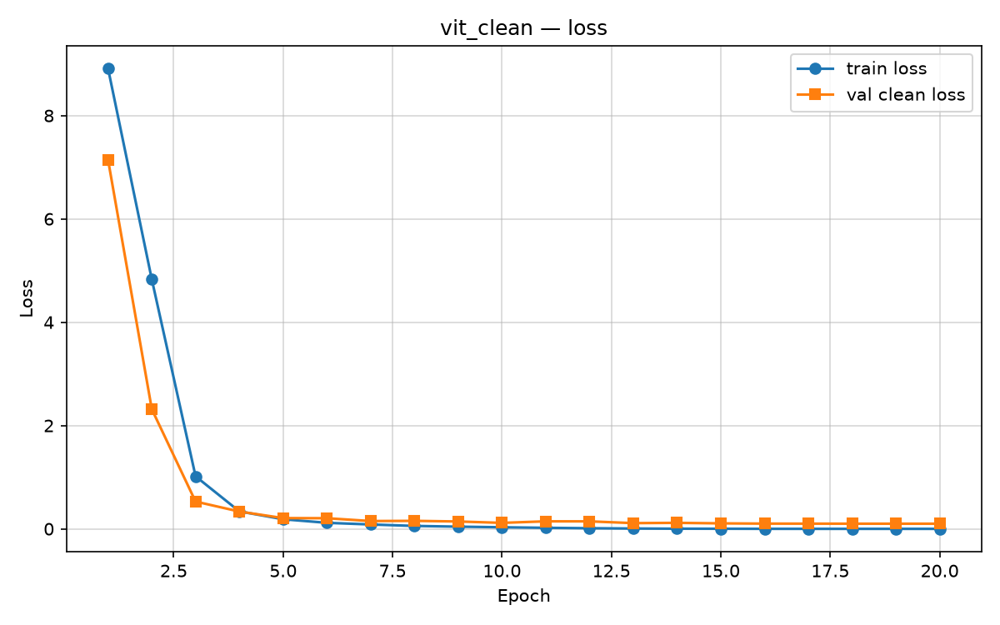

The summed cross-entropy $L$ should fall steadily over 20 epochs. A persistent gap between train loss and `val_clean_loss` points to overfitting on font and noise patterns.

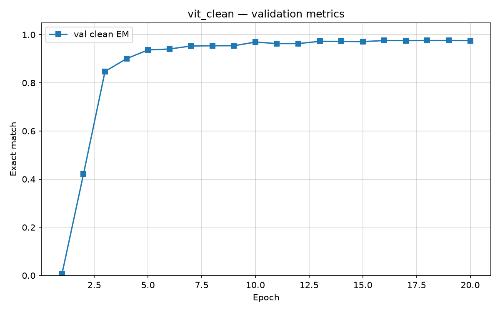

Validation exact match tracks the fraction of val images with a correct four-digit string.

#### ViT fine-tune

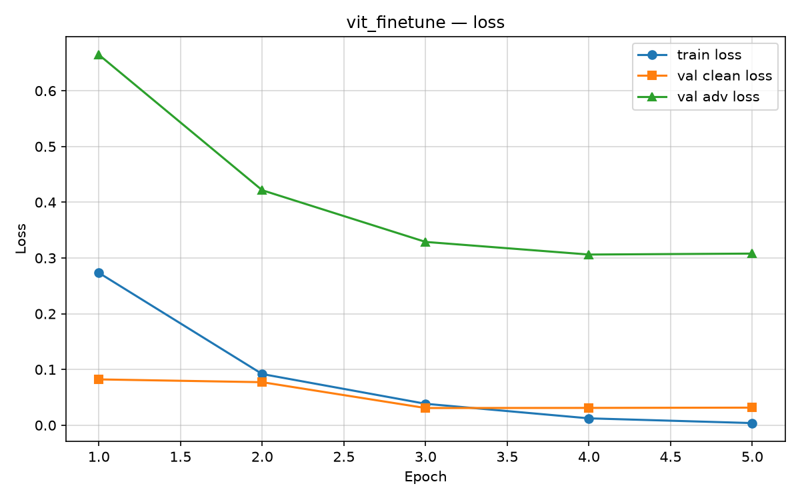

Fine-tuning on the 120k mixed set should keep `val_clean_loss` near the clean checkpoint level while `val_adv_loss` drops relative to the clean-only model.

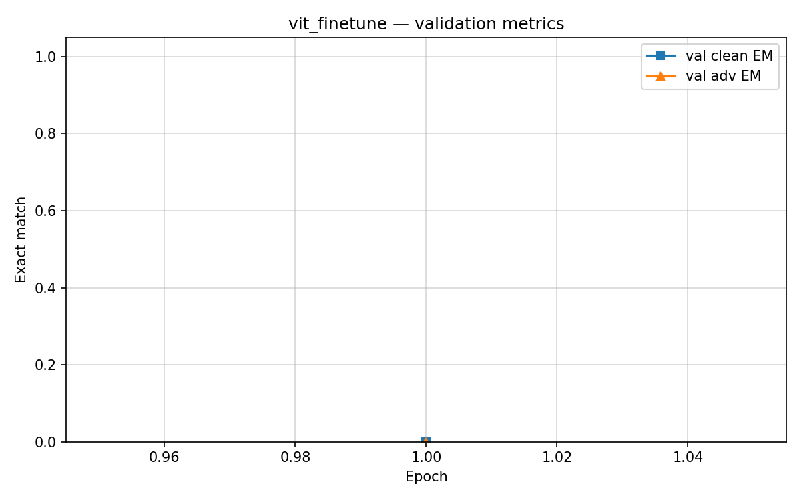

`val_adv_exact_match` measures robustness on FGSM images generated by the ViT clean checkpoint.

#### CNN clean

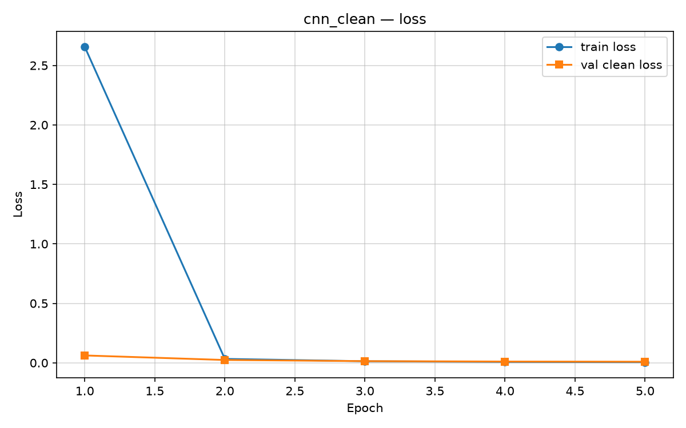

The CNN typically converges faster than the ViT because inductive locality matches fixed digit slots.

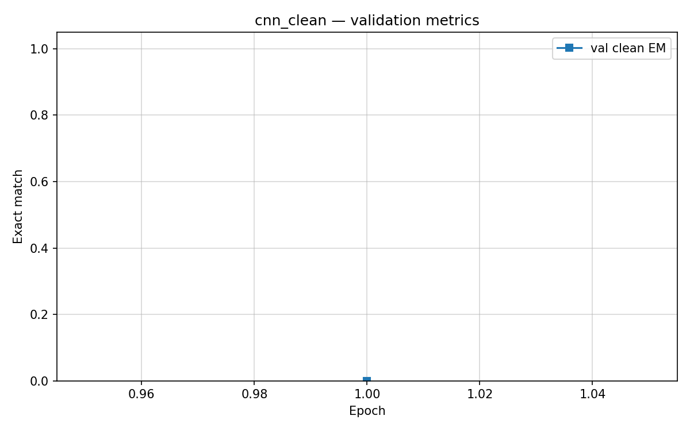

CNN clean exact match on val is the reference for whether convolutional inductive bias helps on this rendering pipeline.

#### CNN fine-tune

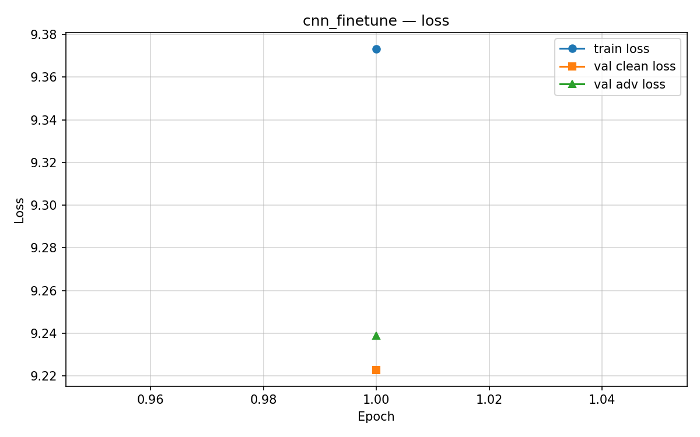

The same mixed-set objective as ViT fine-tune.

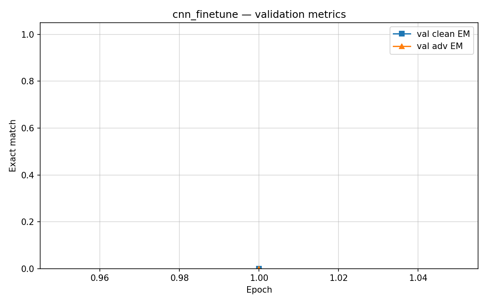

Compare `val_adv_exact_match` against the ViT fine-tune curve to see which architecture retains digit identity under FGSM.

### Test comparison

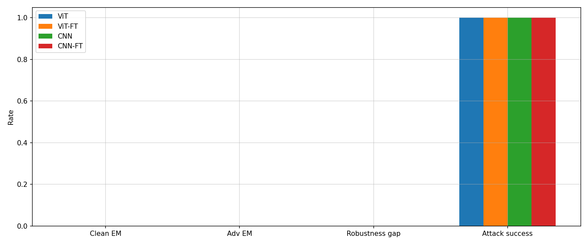

**Clean EM** — accuracy on 5,000 held-out clean test images.

**Adv EM** — accuracy on 1,000 FGSM test images for the matching model family.

**Robustness gap** — clean EM minus adv EM for the same checkpoint.

**Attack success rate** — fraction of clean-correct predictions that become wrong under FGSM.

### Confusion matrices

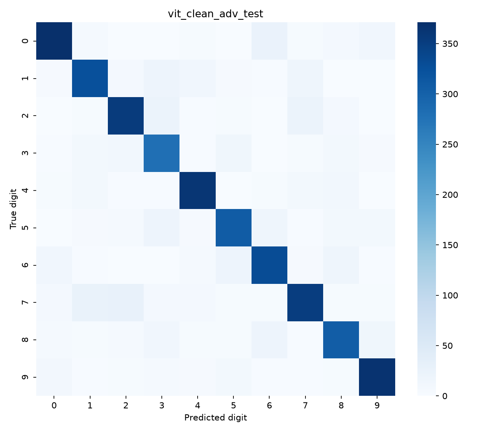

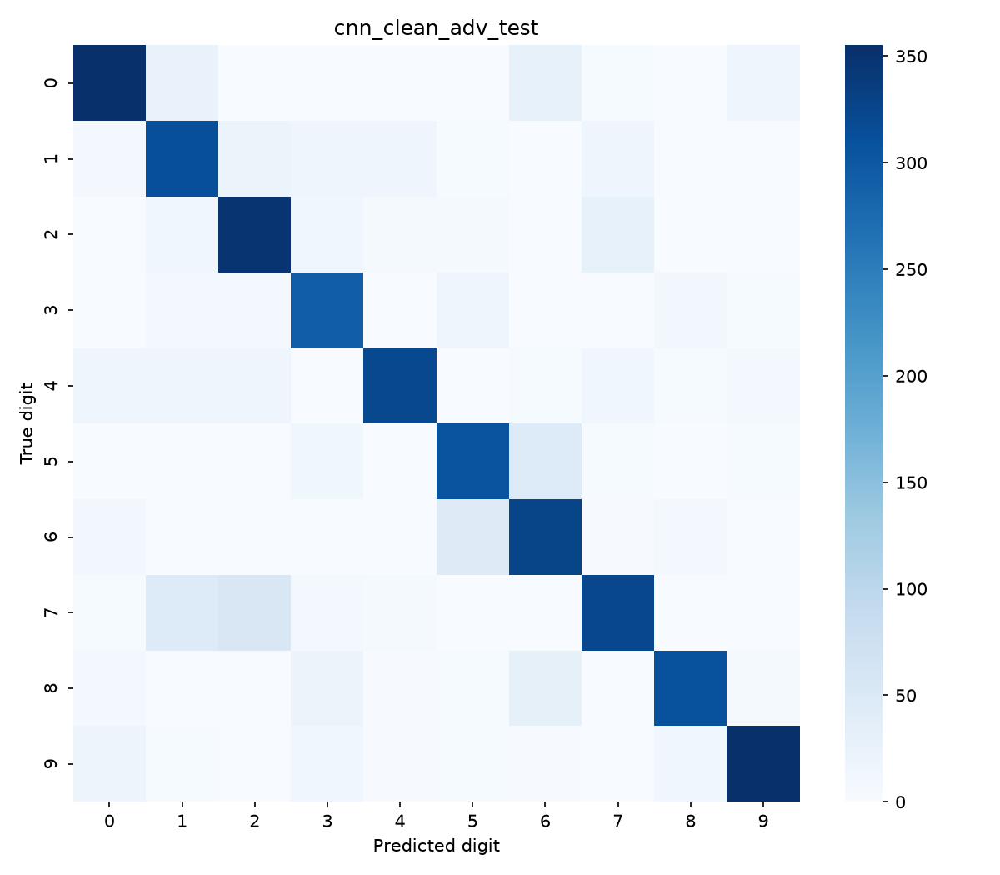

Each heatmap aggregates predictions over all four digit positions into a single $10 \times 10$ count matrix for FGSM test images from the clean checkpoint.

Metrics JSON: `outputs/metrics/test_results.json`. Test predictions: `outputs/predictions/`.

## Project tree

```
4-captcha/
├── pyproject.toml
├── install.py
├── main.py
├── config.py
├── schemas.py
├── requirements.txt
├── .env.example
├── data/
├── models/
├── train/
├── attacks/
├── eval/
├── scripts/
├── hub/
└── outputs/
    ├── metrics/
    ├── plots/
    └── predictions/
```

## Setup

```bash
git clone https://github.com/pymlex/4-captcha.git
cd 4-captcha
python install.py
```

## Dataset generation

```bash
python scripts/generate_dataset.py
```

## Clean training

```bash
python scripts/train_clean.py --model vit
python scripts/train_clean.py --model cnn
```

## FGSM generation

```bash
python scripts/generate_fgsm.py --model vit
python scripts/generate_fgsm.py --model cnn
```

## Fine-tuning

```bash
python scripts/finetune.py --model vit
python scripts/finetune.py --model cnn
```

## Evaluation

```bash
python scripts/evaluate.py
```

## Plotting

```bash
python scripts/plot_results.py
```

## Publish

| Target | Repository |
|--------|------------|
| Metrics, predictions, plots, hub cards | [github.com/pymlex/4-captcha](https://github.com/pymlex/4-captcha) |
| Dataset archive, preview samples | [pymlex/4-captcha](https://huggingface.co/datasets/pymlex/4-captcha) |
| Checkpoints, metrics, plots, model card | [pymlex/4-captcha-solvers](https://huggingface.co/pymlex/4-captcha-solvers) |

```bash
python scripts/publish.py
```

## Citation

If you found this project useful, please cite it as:

```bibtex
@misc{zyukov2026_4captcha,
  author       = {Alex Zyukov},
  title        = {4-captcha: Synthetic Captcha Recognition and Adversarial Fine-tuning},
  year         = {2026},
  publisher    = {GitHub},
  howpublished = {\url{https://github.com/pymlex/4-captcha}}
}
```

```bibtex
@article{dosovitskiy2020vit,
  title   = {An Image is Worth 16x16 Words: Transformers for Image Recognition at Scale},
  author  = {Dosovitskiy, Alexey and Beyer, Lucas and Kolesnikov, Alexander and others},
  journal = {arXiv preprint arXiv:2010.11929},
  year    = {2020}
}
```

```bibtex
@article{goodfellow2014explaining,
  title   = {Explaining and Harnessing Adversarial Examples},
  author  = {Goodfellow, Ian J and Shlens, Jonathon and Szegedy, Christian},
  journal = {arXiv preprint arXiv:1412.6572},
  year    = {2014}
}
```

The project is under GPL-3.0 license.
