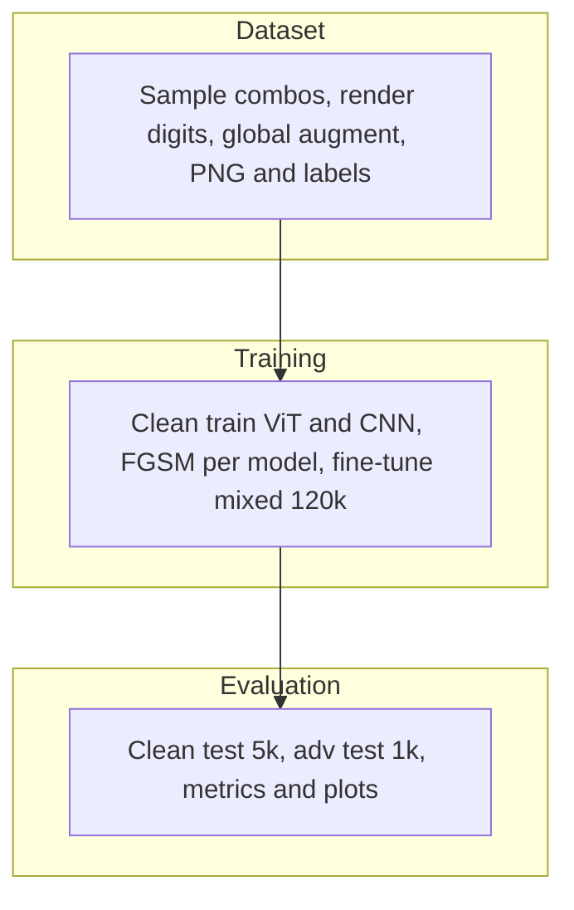

# 4-captcha solvers

Checkpoints for four-digit captcha recognition on the [pymlex/4-captcha](https://huggingface.co/datasets/pymlex/4-captcha) dataset. Two architectures are released: CompactCaptchaNet and CaptchaViT, each with a clean-trained and FGSM fine-tuned variant.

Source code, test predictions, and the full training pipeline: [github.com/pymlex/4-captcha](https://github.com/pymlex/4-captcha)

## Overview

Input is a grayscale $320 \times 80$ image with a four-digit string. Each model outputs logits $Z \in \mathbb{R}^{4 \times 10}$. The training objective is

$$L = \sum_{p=1}^{4} CE(Z_{:,p,:}, y_p)$$

FGSM perturbations follow

$$x_{adv} = clip(x + \varepsilon \cdot sign(\nabla_x L), 0, 1)$$

with $\varepsilon \in \{0.015, 0.03\}$.

| Split | Images |
|-------|--------|
| Clean train | 100,000 |
| Clean val | 5,000 |
| Clean test | 5,000 |
| Adv train per model | 20,000 |
| Adv val per model | 1,000 |
| Adv test per model | 1,000 |



## Architectures

**CompactCaptchaNet** — four stride-2 conv blocks, reshape to $(1280, 20)$, `Conv1d` temporal mixing, adaptive pool to four positions, linear heads. About 1.4M parameters.

**CaptchaViT** — patch size $16 \times 16$, embed dim 256, depth 6, eight heads, learned position queries over patch tokens. About 4.8M parameters.

Clean training runs for 20 epochs. Adversarial fine-tuning runs for 20 epochs on a 120k mixed clean and adversarial set. Checkpoints are stored under `checkpoints/{vit,cnn}/{clean,finetune}/`.

## Test exact match

| Model | Stage | Split | Exact match |
|-------|-------|-------|-------------|
| vit | clean | clean_test | see `metrics/test_results.json` |
| vit | clean | adv_test | see `metrics/test_results.json` |
| vit | finetune | clean_test | see `metrics/test_results.json` |
| vit | finetune | adv_test | see `metrics/test_results.json` |
| cnn | clean | clean_test | see `metrics/test_results.json` |
| cnn | clean | adv_test | see `metrics/test_results.json` |
| cnn | finetune | clean_test | see `metrics/test_results.json` |
| cnn | finetune | adv_test | see `metrics/test_results.json` |

Exact match is the fraction of test images where all four predicted digits match the label. Adversarial splits are model-specific: `adv/vit/test` for ViT checkpoints and `adv/cnn/test` for CNN checkpoints.

## Training curves

### ViT clean


The summed cross-entropy $L$ should fall steadily over 20 epochs. A persistent gap between train loss and `val_clean_loss` points to overfitting on font and noise patterns. If loss remains near $4 \ln 10$, the model has not separated digit classes.


Validation exact match tracks the fraction of val images with a correct four-digit string. Per-position accuracy can exceed exact match because a single wrong digit zeros the sequence metric.

### ViT fine-tune


Fine-tuning on the 120k mixed set should keep `val_clean_loss` near the clean checkpoint level while `val_adv_loss` drops relative to the clean-only model. Divergence between train and both val curves signals imbalance between clean and adversarial batches.


`val_adv_exact_match` measures robustness on FGSM images generated by the ViT clean checkpoint. A successful fine-tune raises adversarial exact match without collapsing clean exact match.

### CNN clean


The CNN typically converges faster than the ViT because inductive locality matches fixed digit slots. Compare final train and val loss to the ViT run at the same epoch count.


CNN clean exact match on val is the reference for whether convolutional inductive bias helps on this rendering pipeline.

### CNN fine-tune


The same mixed-set objective as ViT fine-tune. CNN parameters are fewer, so watch for faster overfitting on adversarial noise.


Compare `val_adv_exact_match` against the ViT fine-tune curve to see which architecture retains digit identity under FGSM.

## Test comparison


The chart groups four test metrics across ViT, ViT-FT, CNN, and CNN-FT.

**Clean EM** — accuracy on 5,000 held-out clean test images.

**Adv EM** — accuracy on 1,000 FGSM test images for the matching model family.

**Robustness gap** — clean EM minus adv EM for the same checkpoint. Lower gap means smaller clean-to-adv degradation.

**Attack success rate** — fraction of clean-correct predictions that become wrong under FGSM. Fine-tuning should reduce this bar while keeping clean EM high.

## Confusion matrices


Each heatmap aggregates predictions over all four digit positions into a single $10 \times 10$ count matrix. Diagonal mass is correct classification mass. Off-diagonal peaks reveal systematic confusions, often between glyphs with similar topology under rotation and elastic warp. Comparing clean and adv panels for the same checkpoint shows which digit pairs FGSM exploits. Comparing clean versus fine-tune panels shows whether robustness training redistributes error mass back toward the diagonal.

## Dataset

[pymlex/4-captcha](https://huggingface.co/datasets/pymlex/4-captcha)

## Citation

```bibtex
@misc{zyukov2026_4captcha,
  author       = {Alex Zyukov},
  title        = {4-captcha: Synthetic Captcha Recognition and Adversarial Fine-tuning},
  year         = {2026},
  howpublished = {\url{https://github.com/pymlex/4-captcha}}
}
```

```bibtex
@article{dosovitskiy2020vit,
  title   = {An Image is Worth 16x16 Words: Transformers for Image Recognition at Scale},
  author  = {Dosovitskiy, Alexey and Beyer, Lucas and Kolesnikov, Alexander and others},
  journal = {arXiv preprint arXiv:2010.11929},
  year    = {2020}
}
```

```bibtex
@article{goodfellow2014explaining,
  title   = {Explaining and Harnessing Adversarial Examples},
  author  = {Goodfellow, Ian J and Shlens, Jonathon and Szegedy, Christian},
  journal = {arXiv preprint arXiv:1412.6572},
  year    = {2014}
}
```

The models are under GPL-3.0 license.
